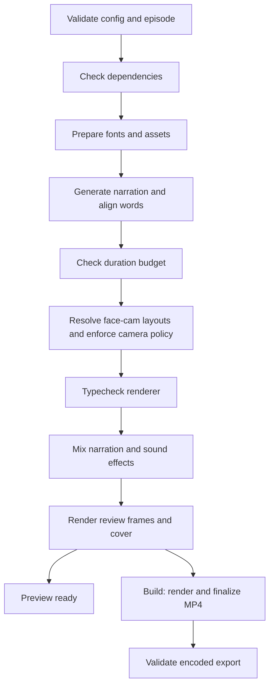

# Video Editing Workflow

Create narrated DSA short videos from a scripted Remotion project. This repository automates asset preparation, speech generation, word alignment, captions, face-cam layouts, audio mixing, rendering, and export validation.

The included episode is **NeetCode 150 — Part 1: Contains Duplicate**. It exports a **1080 × 1920, 30 fps, H.264/AAC MP4**, a cover image, review frames, and build reports. The default configuration uses macOS Daniel narration, a 90-second editorial budget, and face-cam placeholders.

**Current scope:** short-video production using the existing Contains Duplicate animations. New algorithm demonstrations need new graphics. Long-video production will be added as a separate workflow; uploading and publishing are manual.

## Contents

- [Quick start](#quick-start)
- [What each command does](#what-each-command-does)
- [How the pipeline works](#how-the-pipeline-works)
- [Configure a video](#configure-a-video)
- [Narration and browser settings](#narration-and-browser-settings)
- [Review and outputs](#review-and-outputs)
- [Troubleshooting](#troubleshooting)
- [Development and future workflows](#development-and-future-workflows)

## Quick start

### Requirements

| Tool | Required for |
| --- | --- |
| Node.js 22+ and npm | Workflow CLI, React/TypeScript, and Remotion |
| Python 3.10+ and `venv` | Whisper word alignment and synthesized sound effects |
| `ffmpeg` and `ffprobe` on `PATH` | Audio processing, media inspection, and export validation |
| Installed Chromium browser | Rendering frames and video; defaults to Brave on macOS |
| macOS Daniel voice | Default `local` narration provider |

The setup below targets macOS with a POSIX shell. OpenAI narration is also available. The scripts currently use `.venv/bin/python`; native Windows paths are not implemented. Linux requires a suitable Chromium installation and the OpenAI provider.

### Install and check

```sh
git clone https://github.com/vishal-jadeja/video-editing-workflow.git
cd video-editing-workflow

# Install dependencies in the renderer project.
npm ci --prefix neetcode-150/part-01
python3 -m venv neetcode-150/part-01/.venv
neetcode-150/part-01/.venv/bin/pip install -r neetcode-150/part-01/requirements.txt

# Validate the episode, then check local dependencies.
npm run shorts -- plan
npm run shorts -- doctor
```

The root CLI uses Node's standard library and needs no root-level dependency installation. If Brave is not installed, set [the browser executable](#narration-and-browser-settings) before running `doctor`.

### Create your first export

Run these commands from the repository root:

```sh
# Generate narration, mixed audio, review frames, and a cover.
npm run shorts -- preview

# After reviewing, render and validate the final MP4.
npm run shorts -- build
```

You can run `build` directly; a separate `preview` run is optional. The first media run downloads Google Fonts and the Whisper alignment model. Later runs reuse those caches and unchanged narration.

The default video is written to:

```text
neetcode-150/part-01/out/part-01-contains-duplicate.mp4
```

## What each command does

| Command | Behavior | Generates media? |
| --- | --- | --- |
| `npm run shorts -- plan` | Validates workflow/episode inputs and prints build stages and output paths | No |
| `npm run shorts -- doctor` | Validates inputs and checks dependencies, browser executable, and narration prerequisites | No |
| `npm run shorts -- preview` | Runs preflight, prepares assets, generates and aligns narration, checks duration/camera policy, typechecks, mixes audio, and exports review stills and cover | Yes; no final MP4 |
| `npm run shorts -- build` | Runs the preview stages, renders the final MP4, and validates the encoded export | Yes, including MP4 |
| `npm run shorts -- --help` | Prints CLI usage | No |
| `npm test` | Runs workflow tests without generating video | No |

`plan` is the default when no command is supplied. It does not check installed dependencies or resolve actual speech timing. `doctor` checks browser availability and credential presence; it does not launch a render or authenticate against the speech API.

Both `preview` and `build` can generate paid speech when `provider` is `openai`. Neither command uploads the video.

## How the pipeline works



Every production stage must succeed before the next begins. The workflow checks script cue phrases before synthesis, then uses forced alignment to resolve word timing. It enforces the duration budget before rendering and can reject missing face-cam footage.

Final export checks cover dimensions, codecs, pixel format, frame rate, frame count, duration, full-file decoding, and encoded audio loudness/true peak. These technical checks complement a human review of teaching accuracy, pacing, captions, and composition.

## Configure a video

The default job is [workflows/shorts/default.json](workflows/shorts/default.json):

```json
{
  "version": 1,
  "format": "shorts",
  "project": "../../neetcode-150/part-01",
  "episode": "data/part-01.json",
  "facecam": "data/facecam.json",
  "provider": "local",
  "maxDurationSeconds": 90,
  "allowPlaceholderFacecam": true
}
```

| Setting | Meaning |
| --- | --- |
| `version` / `format` | Current contract: `1` / `shorts` |
| `project` | Renderer directory, relative to this config file |
| `episode` | Episode JSON, relative to the renderer directory |
| `facecam` | Camera config JSON, relative to the renderer directory |
| `provider` | `local` for macOS Daniel, or `openai` |
| `maxDurationSeconds` | Maximum aligned timeline duration; speech is never automatically truncated |
| `allowPlaceholderFacecam` | Allow silhouettes when the main recording is missing |

The 90-second limit is an editorial setting, not a statement about a platform's upload rules. Unknown workflow settings are rejected to catch misspellings.

### Use a custom configuration

Copy the config beside the default so its relative project path still works:

```sh
cp workflows/shorts/default.json workflows/shorts/my-video.json
# Edit my-video.json, then use the same config for each command.
npm run shorts -- plan --config workflows/shorts/my-video.json
npm run shorts -- preview --config workflows/shorts/my-video.json
npm run shorts -- build --config workflows/shorts/my-video.json
```

The `--config` argument is relative to your shell's current directory. The workflow passes the selected episode and camera configuration to every production stage.

### Edit the script and graphics

Edit [data/part-01.json](neetcode-150/part-01/data/part-01.json) for narration, code, complexity labels, cue phrases, and layouts. Its scenes run in this order:

`hook → problem → brute → better → one → optimal → cta`

Each cue must occur in that scene's narration. Layout changes reference cue names; aligned timing determines the actual cuts. Edit source data, rather than generated timeline files.

The renderer currently assumes `[1,2,3,1]` and `[1,1,2,3,"…",100000]`; the workflow enforces those examples. The cover also displays `O(n)`. Changing the title or copying the JSON alone is insufficient for a different algorithm. See the [production guide](workflows/shorts/README.md#1-write-the-brief-and-script) for the files to extend.

### Add face-cam footage

Place a recording at `neetcode-150/part-01/assets/facecam.mp4`, then adjust [data/facecam.json](neetcode-150/part-01/data/facecam.json). Before a final camera edition, set `allowPlaceholderFacecam` to `false` in the workflow config.

Footage is cropped and trimmed to the existing edit. Its audio is muted; generated narration remains the master audio. Separate takes, crop controls, and recording timing are documented in [FACECAM.md](neetcode-150/part-01/FACECAM.md). Explicitly configured missing scene-override files fail even when placeholders are allowed.

For a graphics-only video, set every scene's layout to `[{"at":"start","mode":"graphics"}]`.

## Narration and browser settings

| Environment variable | Purpose |
| --- | --- |
| `REMOTION_BROWSER_EXECUTABLE` | Absolute path to an installed Chromium executable |
| `OPENAI_API_KEY` | Required when the workflow provider is `openai` |
| `OPENAI_VOICE` | Override the speech voice configured in the renderer; code default: `cedar` |
| `OPENAI_TTS_MODEL` | Override the speech model configured in the renderer; code default: `gpt-4o-mini-tts` |

For example, to use Chrome on macOS:

```sh
export REMOTION_BROWSER_EXECUTABLE="/Applications/Google Chrome.app/Contents/MacOS/Google Chrome"
npm run shorts -- doctor
```

For OpenAI narration, set `"provider": "openai"` in your chosen workflow config and supply `OPENAI_API_KEY` through your shell or secret manager. Keep credentials out of committed files. The CLI does not automatically load `.env` files. Local narration uses Daniel at 205 words per minute; both providers use local Whisper alignment of the exact script.

## Review and outputs

After `preview`, inspect the images in `out/qa/` and the cover. For motion and audio review, launch Remotion Studio from the renderer directory:

```sh
cd neetcode-150/part-01
npm run studio
```

For a custom episode, set `PART_DATA` and `FACECAM_CONFIG` to the same episode/camera paths when launching Studio. These variables apply to the renderer's individual scripts; the root workflow obtains them from its config. A custom example, run inside the renderer directory:

```sh
PART_DATA="$PWD/data/my-episode.json" \
FACECAM_CONFIG="$PWD/data/my-facecam.json" \
npm run studio
```

The paths above must point to files you created. Studio needs the generated assets from a successful preview first.

All paths below are relative to the renderer project:

| Output | Contents |
| --- | --- |
| `out/<episode-slug>.mp4` | Final video; generated by `build` |
| `out/<episode-slug>-cover.png` | Cover image |
| `out/qa/` | Sampled frames for visual review |
| `out/shorts-workflow.json` | Latest production run's stages, statuses, timestamps, and failure message |
| `out/validation.json` | Latest successful export's format and audio measurements |
| `out/facecam-edit-plan.json` | Resolved camera/layout cuts |
| `src/generated/` | Episode, timeline, camera, and asset manifests used by the renderer |

A successful preview reports `preview-ready`. Only a successful full build reports `passed`. A failed stage reports `failed` and exits nonzero. Input/preflight errors occur before the production report is created, so check the terminal output too.

Watch the final MP4 before publishing, including captions, code, voice timing, and camera crops. Review images only sample the timeline. Suggested narration disclosure: “AI-generated narration.”

## Troubleshooting

| Symptom | Action |
| --- | --- |
| Missing Node dependencies | Run `npm ci --prefix neetcode-150/part-01` from the repository root |
| Python imports fail | Install `requirements.txt` using the renderer's `.venv/bin/pip` |
| `ffmpeg` or `ffprobe` unavailable | Install them and ensure both executables are on `PATH` |
| Daniel voice unavailable | Install Daniel in macOS speech settings, or configure OpenAI narration |
| Missing OpenAI credential | Supply `OPENAI_API_KEY` in the command's environment |
| Browser fails to launch | Verify `REMOTION_BROWSER_EXECUTABLE`; check that the runtime permits launching a local browser |
| First font/model download fails | Check network access and trusted certificates, then rerun |
| Missing or unaligned cue | Make the cue phrase match the scene's narration; rerun the workflow |
| Narration exceeds the duration budget | Shorten the script or deliberately increase `maxDurationSeconds` |
| Missing or too-short face-cam footage | Supply a sufficient recording or adjust trims; see the face-cam guide |
| A project lock already exists | Check `.shorts-workflow.lock/owner.json` and confirm the owning run has stopped before removing the lock directory |

Fix the cause, then rerun the same command. There is no resume or stage-skipping flag. Unchanged speech and alignment are cached, while downstream outputs are rebuilt. Changing script, provider, voice, or model changes the narration cache identity.

Only one workflow may mutate a renderer project at a time. Avoid editing inputs or running individual production scripts during a build. Episodes in the same renderer share generated files, caches, review frames, and reports. Episode-specific MP4 filenames coexist, but rerunning the same slug replaces its export. Old files may remain after failures; inspect the current report before treating an MP4 as freshly validated.

## Development and future workflows

```text
.
├── package.json                    # Root CLI and test commands
├── workflows/shorts/
│   ├── cli.mjs                     # Command parsing and preflight dispatch
│   ├── workflow.mjs                # Validation, gates, locking, and reports
│   ├── default.json                # Default short-video job
│   ├── test/workflow.test.mjs       # Workflow behavior tests
│   └── README.md                   # Detailed production guide
└── neetcode-150/part-01/
    ├── data/                       # Editable episode and camera inputs
    ├── src/                        # Remotion/React video and scene components
    ├── scripts/                    # Narration, alignment, mixing, and export
    ├── assets/                     # Optional recordings and asset credits
    ├── public/                     # Generated media and cached fonts
    └── out/                        # Generated exports and reports
```

Run `npm test` for input validation, duration gates, stage ordering, failure reporting, locking, and placeholder policy. No media dependencies are needed for these tests. For renderer changes, run a real preview/build and inspect the outputs as well.

Generated exports, prepared public assets, fonts, virtual environments, dependencies, optional local portraits/recordings, and the unused root-level `neetcode-*.png` reference artwork are excluded from Git. The recording rules cover MP4, MOV, M4V, and WebM files under the renderer's `assets/` directory. Commit source inputs and code; add ignore rules for other local recording formats or locations when needed.

Add long-video production under `workflows/long/` when its requirements are ready. Give it its own renderer/output directory, aspect ratio, chapter structure, duration policy, and validation. Shared orchestration can be extracted once both workflows have concrete needs.

Further reading: [production guide](workflows/shorts/README.md), [renderer details](neetcode-150/part-01/README.md), [face-cam setup](neetcode-150/part-01/FACECAM.md), and [audio/asset credits](neetcode-150/part-01/assets/sfx/CREDITS.md).
