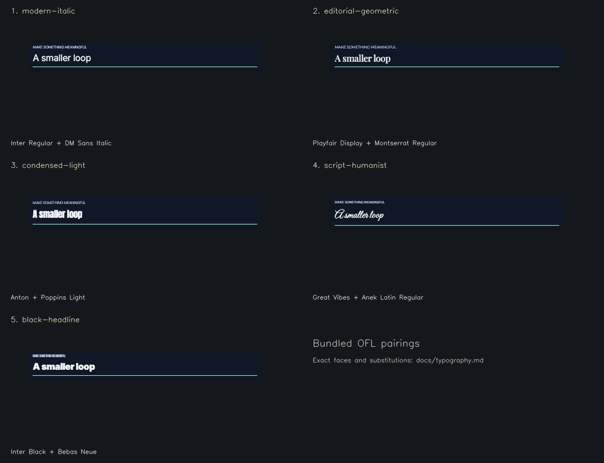

# Requested font pairings

Typography is a selectable token profile, not per-video CSS. Use `fontPairing` in the graphics plan or `mg plan --pairing <id>`. Omitting it uses the preset default. The first face is display (titles/counters), the second is body/captions; code stays IBM Plex Mono. A pairing may add a third `accent` face used only for caption emphasis words. Great Vibes is restricted to display usage, keeping captions and dense information readable.

| Profile ID | Requested pairing | Bundled rendering faces | Status |
| --- | --- | --- | --- |
| `modern-italic` | SF Pro Display Regular + DM Sans Display Italic | Inter Regular + DM Sans Italic | SF Pro substituted; DM Sans is the available family name. |
| `editorial-geometric` | Playfair Display + Gilroy Regular | Playfair Display Medium + Montserrat Regular | Gilroy substituted. |
| `condensed-light` | Collvetica heavy compresses + Poppins Light | Anton + Poppins Light | First family/style is unverified, likely referring to Coolvetica; Anton is an explicit condensed-display substitute. |
| `script-humanist` | Great Vibes + Anek Latin Regular | Great Vibes + Anek Latin Regular | Exact family pairing; suited to brief documentary/film titles rather than dense tech captions. |
| `swiss-grotesk` | Tight grotesk poster headline + neutral grotesk body | Inter Bold (−4.5% tracking) + Inter Regular | Bundled Inter. Default for Clean Tech. |
| `editorial-serif` | Condensed italic editorial serif + grotesk body | Instrument Serif Italic + Inter Medium | Exact OFL family. |
| `grotesk-serif-accent` | Grotesk headlines and captions with a sparing italic-serif emphasis word | Inter Bold + Inter Medium, Instrument Serif Italic for caption emphasis only | Exact OFL families. Opt-in. |
| `poster-grotesk` | Tight grotesk poster headline + medium grotesk captions, no serif | Inter Bold (−4.5% tracking) + Inter Medium | Bundled Inter. Default for High-Energy Shorts. |
| `cinema-serif` | Roman editorial serif + grotesk body | Instrument Serif Regular + Inter Regular | Exact OFL family. Default for Cinematic Doc. |
| `black-headline` | SF Pro Display Black + Headliner | Inter Black + Bebas Neue | Both are explicit substitutes; “Headliner” needs an exact foundry/family identification. |

All shipped files are local Latin WOFF2 with SIL OFL 1.1 notices in `public/fonts`. No synthetic bold or italic is used for these pairs: weights and styles are loaded from actual files. The default fonts are fully runnable; missing proprietary files do not create broken profiles or silent runtime fallbacks.

The [Apple SF font license](https://developer.apple.com/fonts/) restricts its downloaded font to specified Apple-interface uses and does not grant a general-purpose film-graphics license. Do not copy system or developer fonts into the repository on the assumption that a Mac installation grants redistribution rights. [Coolvetica](https://typodermicfonts.com/coolvetica/) has multiple styles and licensing choices; the exact requested weight must be identified. [Headliner No. 45](https://www.myfonts.com/collections/headliner-no-45-font-kc-fonts) is one possible match, but is not assumed to be the user's intended font. Its commercial licensing is separate from a free personal-use demo. Gilroy also requires confirmation of the applicable foundry license and licensed file.

To switch to exact proprietary faces, obtain the specific font files and rights covering the render workflow (including local browser loading) and any redistribution. Add them as a documented engine asset contribution; replace only the relevant face definitions in `src/tokens/typography.ts`, update the license register, run actual rendered layout checks and inspect/rebaseline all affected snapshots. Keep restricted font binaries out of a distributed repository unless redistribution is explicitly permitted. Until then the table above is the honest record of what renders.

[NEEDS INPUT] for exact proprietary matches: the intended Collvetica/Coolvetica family and weight, the exact Headliner family/foundry, and the font files plus suitable rights for SF Pro, Gilroy and those exact faces. The shipped OFL profiles remain usable without this information.
